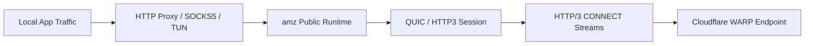

# amz

> A WARP / MASQUE transport kernel aligned with the Cloudflare WARP 2026 Proxy Mode path.
>
> `amz` provides the protocol and runtime layer of this repository: QUIC, HTTP/3, HTTP/3 CONNECT stream relay, local proxy runtimes, tunnel scaffolding, Cloudflare compatibility behavior, and basic transport observability.

## Project Positioning

`amz` is the **transport and runtime kernel** of the project.

It is intended for two audiences:

- **internal integration** — as the engine behind `igara`
- **external embedding** — as a reusable Go package for proxy / tunnel integration

It is **not** primarily an end-user product layer. It does not aim to be:

- a desktop UI
- a full account management product surface
- a complete service manager

Those concerns belong to higher-level layers. `amz` focuses on transport establishment, proxy/tunnel runtime behavior, compatibility handling, and lifecycle control.

## Current Status

As of **March 24, 2026**, the most important validated fact is:

- the **HTTP Proxy Mode mainline is working**
- real `ipwho.is` integration confirmed an **egress IP change**
- both **explicit endpoint** and **auto-selected endpoint** flows have been validated

That means the current implementation is no longer only “able to connect”. It has already proven this end-to-end path:

`local proxy -> QUIC / HTTP3 -> HTTP/3 CONNECT stream -> Cloudflare WARP path -> changed egress IP`

## Mainline Direction

Following Cloudflare’s 2026 Proxy Mode direction, the primary path is centered on:

- **QUIC**
- **HTTP/3**
- **HTTP/3 CONNECT**
- **direct L4 proxying over streams**

Accordingly, `amz` treats the following as the mainline:

- HTTP proxy mode
- SOCKS5 CONNECT mapping
- MASQUE stream relay

And treats the following as compatibility / completion work:

- TUN mode
- CONNECT-IP session flow
- deeper host-level route integration

## Implemented Capabilities

### 1. QUIC / HTTP/3 transport establishment

- real UDP socket flow
- real QUIC handshake
- real HTTP/3 client connection establishment
- Cloudflare-oriented transport tuning
- port fallback across:
  - `443`
  - `500`
  - `1701`
  - `4500`
  - `4443`
  - `8443`
  - `8095`

### 2. HTTP/3 CONNECT mainline

- real HTTP/3 CONNECT stream dialing
- local HTTP CONNECT mapped to remote MASQUE streams
- local SOCKS5 CONNECT mapped to remote MASQUE streams
- bidirectional L4 stream relay
- stream lifecycle, close semantics, and error propagation

### 3. Real traffic validation

The project has already validated real traffic through [`https://ipwho.is/`](https://ipwho.is/):

- tunnel establishment succeeds
- proxied traffic actually traverses the mainline path
- egress IP changes after proxy activation

### 4. Configuration and runtime surface

- `config.KernelConfig`
- HTTP / SOCKS5 / TUN mode configuration
- common runtime lifecycle:
  - `Start`
  - `Stop`
  - `Close`
  - `State`
  - `Stats`

### 5. Cloudflare compatibility handling

- validated working SNI: `warp.cloudflare.com`
- H3 datagram-related compatibility settings
- correction of malformed Extended CONNECT behavior
- contextual error wrapping for Cloudflare-specific failures

## In Progress

The project still has meaningful work remaining in these areas:

### TUN / CONNECT-IP compatibility

- real CONNECT-IP negotiation and address delivery
- full TUN data-plane validation
- broader route setup / rollback completion

### SOCKS5 completion work

- real authentication flow
- real `UDP ASSOCIATE` data plane

### Hardening and productization

- richer structured stats
- broader log sanitization and diagnostics
- more real-network regression coverage

## Package Layout

`amz` is now organized by responsibility:

- `config/`
  - config model, defaults, validation
- `session/`
  - QUIC / HTTP3 / CONNECT stream / CONNECT-IP public session surface
- `proxy/http/`
  - HTTP proxy runtime
- `proxy/socks5/`
  - SOCKS5 runtime
- `tun/`
  - TUN runtime and related public types
- `datapath/`
  - packet relay abstractions
- `cloudflare/`
  - Cloudflare compatibility public surface
- `observe/`
  - stats and sanitization-facing types

The root package `github.com/skye-z/amz` acts as the default façade.

## Usage

## Recommended path: HTTP Proxy Mode

If you want the most clearly validated path today, start with HTTP Proxy Mode.

```go
package main

import (
	"context"

	"github.com/skye-z/amz"
	"github.com/skye-z/amz/config"
)

func main() {
	cfg := &config.KernelConfig{
		Endpoint: "162.159.198.2:443",
		SNI:      "warp.cloudflare.com",
		Mode:     config.ModeHTTP,
		HTTP: config.HTTPConfig{
			ListenAddress: "127.0.0.1:8080",
		},
	}
	cfg.FillDefaults()
	if err := cfg.Validate(); err != nil {
		panic(err)
	}

	proxy, err := amz.NewHTTPProxy(cfg)
	if err != nil {
		panic(err)
	}
	defer proxy.Close()

	if err := proxy.Start(context.Background()); err != nil {
		panic(err)
	}
}
```

Recommended validation flow:

1. start the local HTTP proxy
2. route client traffic through it
3. visit `https://ipwho.is/` before and after activation
4. confirm that the egress IP changes

## SOCKS5 Proxy Mode

```go
cfg := &config.KernelConfig{
    Endpoint: "162.159.198.2:443",
    SNI:      "warp.cloudflare.com",
    Mode:     config.ModeSOCKS,
    SOCKS: config.SOCKSConfig{
        ListenAddress: "127.0.0.1:1080",
    },
}
cfg.FillDefaults()

proxy, err := amz.NewSOCKS5Proxy(cfg)
```

The main SOCKS5 path already exists, but authentication and UDP data-plane completion still remain on the roadmap.

## TUN Mode (compatibility / still being completed)

```go
cfg := &config.KernelConfig{
    Endpoint: "162.159.198.2:443",
    SNI:      "warp.cloudflare.com",
    Mode:     config.ModeTUN,
    TUN: config.TUNConfig{
        Name: "igara0",
    },
}
cfg.FillDefaults()

tunRuntime, err := amz.NewTunnel(cfg)
```

Important notes:

- TUN and route mutation usually require elevated privileges
- the most clearly validated production path right now is still **HTTP Proxy Mode**
- if your first priority is proving that the traffic path is real, start with HTTP mode

## Advanced integration

If you need direct control over lower-level assembly, use the layered packages directly:

- `session/`
- `proxy/http/`
- `proxy/socks5/`
- `tun/`
- `cloudflare/`

Typical reasons to do this:

- custom runtime orchestration
- embedding transport pieces into a larger system
- deeper protocol-level integration

## Architecture Overview



At a high level:

- `config` defines input
- `session` manages remote transport state
- `proxy` and `tun` expose local runtime surfaces
- `datapath` provides packet relay abstractions
- `cloudflare` exposes compatibility-oriented public surface
- the root package `amz` provides the default entry point

## Testing

Basic validation:

```bash
go test ./amz/...
```

Integration-focused validation:

```bash
go test ./amz/... ./igara/internal/e2e ./igara/internal/endpoint ./igara/internal/runner -count=1
```

## Notes and Limitations

- Cloudflare server-side behavior may continue to evolve
- TUN and route mutation are much more environment-sensitive than HTTP proxy mode
- even if control-plane establishment succeeds, real traffic validation is still the reliable final check
- the most mature and clearly field-validated path today is **HTTP Proxy Mode**

## Roadmap

The most valuable next steps are:

1. finish the TUN / CONNECT-IP compatibility path
2. complete SOCKS5 authentication and `UDP ASSOCIATE`
3. deepen reconnect, keepalive, and real-network hardening
4. expand structured stats, diagnostics, and public-facing documentation
