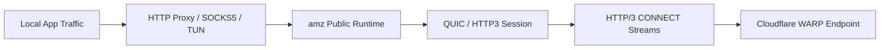

# amz

> 面向 Cloudflare WARP 2026 Proxy Mode 的传输内核。
>
> `amz` 提供本仓库的协议与运行时核心能力：QUIC、HTTP/3、HTTP/3 CONNECT、MASQUE stream 转发、代理运行时、TUN 骨架、Cloudflare 兼容处理与基础观测。

## 项目定位

`amz` 是本仓库中的**协议 / 运行时内核层**。

它同时服务两类场景：

- **仓库内部集成**：作为 `igara` 的底层传输引擎
- **外部程序嵌入**：作为可复用的 Go 包，被其他程序直接集成

它不是一个完整的终端用户产品层，也不负责：

- 完整账号注册体验
- UI / 桌面端产品界面
- 服务管理器或守护进程产品包装

这些能力应由上层系统负责；`amz` 聚焦在**传输、代理、隧道、兼容和运行时生命周期**。

## 当前状态

截至 **2026-03-24**，`amz` 当前最重要的已知事实是：

- **HTTP Proxy Mode 主线已打通**
- **真实 `ipwho.is` 联调已确认出口 IP 发生变化**
- **自动候选与显式节点两条路径均已验证**

也就是说，当前仓库已经不只是“协议层能建链”，而是完成了：

`本地代理 -> QUIC / HTTP3 -> HTTP/3 CONNECT stream -> Cloudflare WARP 路径 -> 出口 IP 变化`

## 为什么是现在这条主线

自 2026 年 3 月 Cloudflare 公布新的 WARP Proxy Mode 路线后，主方向已经不再是“先以 CONNECT-IP 为中心”，而是：

- **QUIC**
- **HTTP/3**
- **HTTP/3 CONNECT**
- **基于 stream 的 direct L4 proxying**

因此，`amz` 当前把以下能力视为主线：

- HTTP 代理
- SOCKS5 CONNECT 流量映射
- 基于 MASQUE stream 的双向 relay

而把以下能力视为兼容 / 补完路径：

- TUN 模式
- CONNECT-IP 会话
- 更完整的系统路由接管

## 已实现能力

### 1. QUIC / HTTP/3 建链能力

- 真实 UDP socket、QUIC 握手、HTTP/3 client connection 已接入
- 已对齐 Cloudflare 当前可用的关键兼容参数
- 已支持端点回退策略：
  - `443`
  - `500`
  - `1701`
  - `4500`
  - `4443`
  - `8443`
  - `8095`

### 2. HTTP/3 CONNECT 主线

- 已实现真实 HTTP/3 CONNECT stream dial
- 已实现本地 HTTP CONNECT 请求到远端 MASQUE stream 的映射
- 已实现本地 SOCKS5 CONNECT 请求到远端 MASQUE stream 的映射
- 已实现双向 L4 stream relay
- 已处理 stream 生命周期、关闭语义与错误传播

### 3. 真实链路验证

已通过真实 `https://ipwho.is/` 联调确认：

- 建链成功
- 流量确实经由代理主线转发
- 出口 IP 发生变化

### 4. 配置与运行时模型

- 已提供 `config.KernelConfig`
- 已支持 HTTP / SOCKS5 / TUN 三种模式的配置组织
- 已提供统一生命周期能力：
  - `Start`
  - `Stop`
  - `Close`
  - `State`
  - `Stats`

### 5. Cloudflare 兼容处理

- 已对齐当前真实可用 SNI：`warp.cloudflare.com`
- 已补齐 H3 datagram 相关兼容设置
- 已修复错误的 Extended CONNECT 构造问题
- 已补充 Cloudflare 特殊响应与错误语义映射

## 仍在进行中的能力

当前仍在继续补齐的部分主要有：

### TUN / CONNECT-IP 兼容路径

- 真实 CONNECT-IP 会话协商与地址下发
- TUN 数据面完整联调
- 更完整的系统路由接管与回滚

### SOCKS5 细节补完

- 真实 SOCKS5 认证握手
- `UDP ASSOCIATE` 数据面

### 工程化与稳定性

- 更丰富的结构化统计输出
- 更完整的日志脱敏与排障信息
- 更全面的真实网络环境回归

## 目录结构

`amz` 现在按领域职责组织为：

- `config/`
  - 配置模型、默认值、校验
- `session/`
  - QUIC / HTTP3 / CONNECT stream / CONNECT-IP 会话相关公共包面
- `proxy/http/`
  - HTTP 代理运行时
- `proxy/socks5/`
  - SOCKS5 运行时
- `tun/`
  - TUN 运行时与相关公共类型
- `datapath/`
  - packet relay 抽象
- `cloudflare/`
  - Cloudflare 兼容层公共包面
- `observe/`
  - 统计 / 脱敏相关公共能力

根包 `github.com/skye-z/amz` 作为统一入口层，对外提供最常用的构造函数。

## 使用方案

## 方案一：当前推荐 —— HTTP Proxy Mode

如果你希望优先使用**当前已完成真实验证**的路径，推荐从 HTTP Proxy Mode 开始。

```go
package main

import (
	"context"

	"github.com/skye-z/amz"
	"github.com/skye-z/amz/config"
)

func main() {
	cfg := &config.KernelConfig{
		Endpoint: "162.159.198.2:443",
		SNI:      "warp.cloudflare.com",
		Mode:     config.ModeHTTP,
		HTTP: config.HTTPConfig{
			ListenAddress: "127.0.0.1:8080",
		},
	}
	cfg.FillDefaults()
	if err := cfg.Validate(); err != nil {
		panic(err)
	}

	proxy, err := amz.NewHTTPProxy(cfg)
	if err != nil {
		panic(err)
	}
	defer proxy.Close()

	if err := proxy.Start(context.Background()); err != nil {
		panic(err)
	}
}
```

推荐验证方式：

1. 启动本地 HTTP 代理
2. 让客户端流量经过该代理
3. 在连接前后访问 `https://ipwho.is/`
4. 确认出口 IP 是否发生变化

## 方案二：SOCKS5 Proxy Mode

```go
cfg := &config.KernelConfig{
    Endpoint: "162.159.198.2:443",
    SNI:      "warp.cloudflare.com",
    Mode:     config.ModeSOCKS,
    SOCKS: config.SOCKSConfig{
        ListenAddress: "127.0.0.1:1080",
    },
}
cfg.FillDefaults()

proxy, err := amz.NewSOCKS5Proxy(cfg)
```

当前 SOCKS5 主体路径已具备，但相较于 HTTP 主线，后续仍有认证与 UDP 数据面细节待补完。

## 方案三：TUN 模式（兼容 / 补完中）

```go
cfg := &config.KernelConfig{
    Endpoint: "162.159.198.2:443",
    SNI:      "warp.cloudflare.com",
    Mode:     config.ModeTUN,
    TUN: config.TUNConfig{
        Name: "igara0",
    },
}
cfg.FillDefaults()

tunRuntime, err := amz.NewTunnel(cfg)
```

注意：

- TUN 与系统路由通常需要更高权限
- 当前最明确完成真实联调验证的主线，仍然是 HTTP Proxy Mode
- 如果你的目标是先确认“链路是否真生效”，建议先从 HTTP 模式开始

## 高级集成方式

如果你需要直接控制底层会话与代理装配，可以使用新的分层包：

- `session/`：连接管理、CONNECT stream、CONNECT-IP、bootstrap dialer
- `proxy/http/`：HTTP 代理 runtime
- `proxy/socks5/`：SOCKS5 runtime
- `tun/`：TUN runtime / 路由 / 配置
- `cloudflare/`：兼容层能力

适用场景：

- 想自行编排连接生命周期
- 想复用底层组件而不是只用统一 façade
- 想把 `amz` 作为库嵌入更复杂系统

## 架构概览



主线关系：

- `config` 定义输入
- `session` 管理远端连接
- `proxy` / `tun` 负责本地运行时
- `datapath` 负责 packet relay 抽象
- `cloudflare` 提供兼容能力
- 根包 `amz` 提供统一入口

## 测试

常见验证命令：

```bash
go test ./amz/...
```

如果同时验证与 `igara` 的集成：

```bash
go test ./amz/... ./igara/internal/e2e ./igara/internal/endpoint ./igara/internal/runner -count=1
```

## 风险与注意事项

- Cloudflare 服务端行为可能持续演进，兼容逻辑需要继续跟随验证
- TUN 与系统路由能力受平台、权限和环境影响更大
- 即使控制面建链成功，也应通过真实流量验证出口是否已切换
- 当前最成熟、最明确完成真实验证的是 **HTTP Proxy Mode**

## 下一步路线

接下来更值得继续推进的方向是：

1. 完善 TUN / CONNECT-IP 兼容路径
2. 补齐 SOCKS5 认证与 UDP associate 数据面
3. 加强重连、保活和真实网络环境下的稳定性验证
4. 完善结构化统计、日志和对外文档
